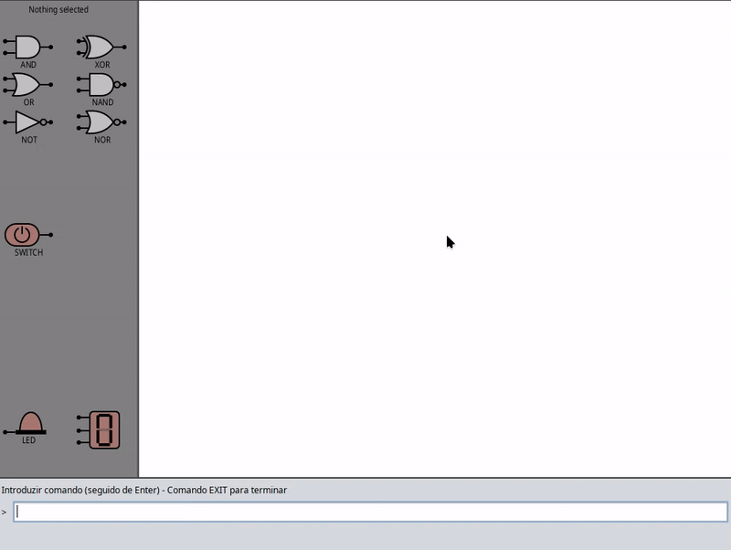

# Logic Flow

Logic Flow is an application developed with **Spring Boot** to manage logical flows of information and processes. This project uses **PostgreSQL** as the database and is configured with **Gradle** as the build system.

This was a 2nd year university project, graded 20 out of 20.

Example of modded branch


---

## Features
- User management with token-based authentication.
- Dynamic data handling for logical flows.
- REST APIs for efficient communication with the frontend.
- Secure configurations for future integrations.

---

## Technologies Used
- **Java 21**: Main programming language.
- **Spring Boot 3.4.1**: Backend development framework.
- **PostgreSQL**: Relational database.
- **Gradle**: Build system and dependency management.
- **NGINX** (optional): Reverse proxy to serve the application.

---

## Requirements
Make sure you have the following installed:

- Java 21 or higher
- Gradle
- PostgreSQL 14 or higher
- NGINX (if applicable)

---

## Setup

### 1. Clone the Repository
```bash
git clone <repository-url>
cd LogicFlow
```

### 2. Configure PostgreSQL
1. Create a database named `logicflow`.
2. Update the credentials in `application.properties` or `application.yml`:

```properties
spring.datasource.url=jdbc:postgresql://localhost:5432/logicflow
spring.datasource.username=<your-username>
spring.datasource.password=<your-password>
```

### 3. Build the Project
Run the following command to build the application:
```bash
./gradlew build
```

### 4. Start the Application
Run the application with:
```bash
./gradlew bootRun
```
The application will be available at [http://localhost:8080](http://localhost:8080) by default.

---

## Main Endpoints
### 1. Test Connectivity
**Endpoint:** `/ping`
- **Method:** GET
- **Parameters:**
  - `username`: Username
  - `token`: Authentication token
- **Example Response:**
  ```json
  {
      "message": "pong"
  }
  ```

---

## Project Structure

```
LogicFlow/
├── Server/
│   ├── src/
│   │   ├── main/
│   │   │   ├── java/
│   │   │   │   ├── LogicFlow/
│   │   │   │   │   └── LogicFlowApplication.java
│   │   │   ├── resources/
│   │   │       └── application.properties
└── build.gradle
```

---

## License
This project is distributed under the GPL-3.0 license. See the `LICENSE` file for more information.

---

## Authors
Created by **Goncalo Marques** and **Joao Barbosa**.
